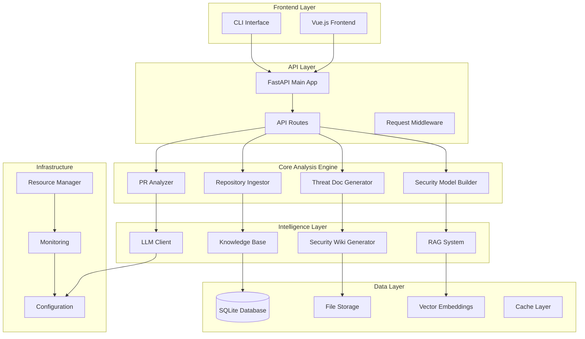
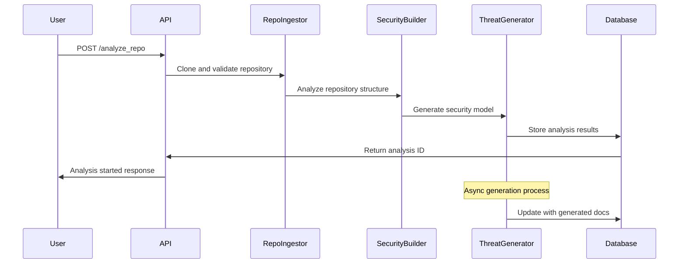
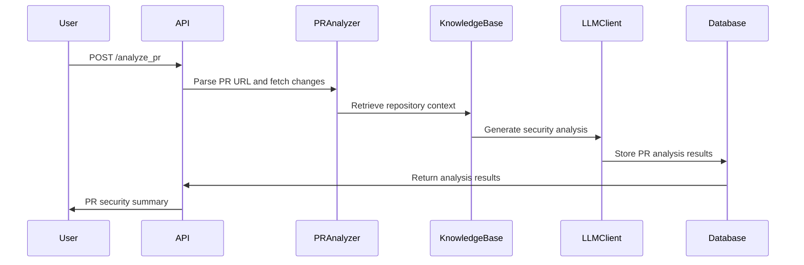

# ThreatLens Architecture Documentation

## System Overview

ThreatLens is a comprehensive threat modeling documentation generator that analyzes code repositories and generates security documentation using OWASP methodologies. The system follows a modular architecture with clear separation of concerns across analysis, generation, and storage layers.

## High-Level Architecture

## Component Breakdown

### 1. Frontend Layer

#### Vue.js Frontend (`frontend/`)
- **Purpose**: Web-based user interface for repository analysis and threat model visualization
- **Key Components**:
  - Repository analysis forms and status displays
  - PR analysis interface with security insights
  - Document search and browsing capabilities
  - Real-time analysis progress tracking
- **Technology Stack**: Vue 3, TypeScript, Tailwind CSS, Vite

#### CLI Interface (`cli/` - planned)
- **Purpose**: Command-line interface for automated workflows and CI/CD integration
- **Planned Commands**:
  - `analyze-repo`: Full repository security analysis
  - `analyze-pr`: Pull request security review
  - `generate-docs`: Comprehensive documentation generation

### 2. API Layer

#### FastAPI Main Application (`api/main.py`)
- **Purpose**: Central HTTP API server with comprehensive request handling
- **Key Features**:
  - RESTful API endpoints for all system operations
  - Request/response validation with Pydantic models
  - Comprehensive error handling and logging
  - Rate limiting and security middleware
  - Health monitoring and metrics collection

#### Core API Endpoints
- **Repository Analysis**: `/analyze_repo`, `/repo_status`, `/validate_repo`
- **PR Analysis**: `/analyze_pr`, `/pr_status`
- **Document Management**: `/documents`, `/search_docs`
- **System Health**: `/health`, `/resources`, `/github_status`

### 3. Core Analysis Engine

#### Repository Ingestor (`api/repo_ingest.py`)
- **Purpose**: Repository cloning, validation, and initial structure analysis
- **Capabilities**:
  - Git repository cloning and validation
  - File system structure analysis
  - Language and framework detection
  - Security-relevant file identification
  - Large repository handling with size limits

#### Security Model Builder (`api/security_model.py`)
- **Purpose**: Comprehensive security model construction from repository analysis
- **Analysis Components**:
  - Component detection (controllers, services, models, middleware)
  - API endpoint extraction with security annotations
  - Authentication mechanism identification
  - Data store and external dependency mapping
  - Trust boundary identification
  - Data flow analysis with sensitivity classification

#### PR Analyzer (`api/pr_analyzer.py`)
- **Purpose**: GitHub PR integration and security-focused change analysis
- **Features**:
  - GitHub API integration with rate limiting
  - Diff parsing and security pattern detection
  - Changed file categorization by security relevance
  - Risk assessment based on change patterns
  - Context-aware analysis using repository knowledge

#### Threat Document Generator (`api/threat_docs.py`)
- **Purpose**: AI-powered security documentation generation
- **Generation Types**:
  - Comprehensive repository threat models
  - Component-specific security documentation
  - PR security summaries and recommendations
  - STRIDE-based threat identification
  - Mitigation strategy recommendations

### 4. Intelligence Layer

#### RAG System (`api/rag.py`)
- **Purpose**: Retrieval-Augmented Generation for context-aware security analysis
- **Components**:
  - Vector embedding generation and storage
  - Semantic search over security knowledge bases
  - Context retrieval for LLM prompts
  - OWASP content integration
  - External security reference integration

#### LLM Client (`api/llm_client.py`)
- **Purpose**: Large Language Model integration for content generation
- **Supported Providers**:
  - OpenAI GPT models
  - Anthropic Claude models
  - Local model support (planned)
- **Features**:
  - Intelligent model selection based on task
  - Token usage optimization
  - Response caching and rate limiting

#### Knowledge Base (`api/knowledge_base.py`)
- **Purpose**: Repository-specific knowledge management and retrieval
- **Capabilities**:
  - Repository context storage and indexing
  - Code pattern recognition and cataloging
  - Security knowledge accumulation
  - Cross-repository learning and pattern sharing

#### Security Wiki Generator (`api/security_wiki_generator.py`)
- **Purpose**: Structured security documentation generation
- **Output Formats**:
  - Markdown documentation with proper formatting
  - Interactive HTML reports
  - JSON structured data for API consumption
  - Integration with external documentation systems

### 5. Data Layer

#### SQLite Database (`api/database.py`)
- **Purpose**: Primary data persistence for analysis results and metadata
- **Schema Components**:
  - Repository metadata and analysis status
  - Security models and component relationships
  - Threat documentation and versioning
  - User sessions and analysis history
  - System configuration and settings

#### File Storage (`api/storage_manager.py`)
- **Purpose**: Organized file system storage for various content types
- **Storage Categories**:
  - `repos/`: Cloned repository content
  - `docs/`: Generated documentation files
  - `embeddings/`: Vector embedding storage
  - `cache/`: Temporary analysis artifacts
  - `backups/`: System backup files

#### Vector Embeddings (`data/embeddings/`)
- **Purpose**: Semantic search capabilities over security content
- **Content Types**:
  - Repository code embeddings
  - OWASP cheat sheet embeddings
  - Security documentation embeddings
  - External reference embeddings

### 6. Infrastructure Layer

#### Resource Manager (`api/resource_manager.py`)
- **Purpose**: Intelligent system resource allocation and optimization
- **Capabilities**:
  - CPU/GPU detection and allocation
  - Memory usage monitoring and optimization
  - Processing mode selection (CPU/GPU/Hybrid)
  - Concurrent operation management
  - Performance optimization based on system capabilities

#### Monitoring System (`api/monitoring.py`)
- **Purpose**: Comprehensive system health and performance monitoring
- **Monitoring Areas**:
  - System resource usage (CPU, memory, disk)
  - API request metrics and performance
  - Analysis pipeline health and bottlenecks
  - Error tracking and alerting
  - User activity and usage patterns

#### Configuration Management (`api/config.py`)
- **Purpose**: Centralized configuration management with validation
- **Configuration Areas**:
  - LLM provider settings and API keys
  - Database and storage paths
  - Security and authentication settings
  - Analysis parameters and thresholds
  - External service integrations

## Data Flow Architecture

### Repository Analysis Flow

### PR Analysis Flow

## OWASP Integration Points

### 1. Threat Modeling Methodology
- **Integration**: Core analysis engine follows OWASP Threat Modeling methodology
- **Implementation**: Four-question framework embedded in analysis pipeline
- **Location**: `api/security_model.py`, `api/threat_docs.py`

### 2. STRIDE Framework
- **Integration**: Threat identification uses STRIDE categories
- **Implementation**: Systematic threat categorization in security model building
- **Location**: `api/models.py` (StrideCategory enum), threat generation logic

### 3. OWASP Cheat Sheets
- **Integration**: RAG system incorporates OWASP cheat sheet content
- **Implementation**: Vector embeddings of cheat sheet content for context retrieval
- **Location**: `api/rag.py`, `data/embeddings/`

### 4. Security Patterns
- **Integration**: Code analysis detects OWASP-recommended security patterns
- **Implementation**: Pattern matching in security model builder
- **Location**: `api/security_model.py` security pattern detection

### 5. Risk Assessment
- **Integration**: Risk scoring follows OWASP risk rating methodology
- **Implementation**: Likelihood × Impact calculation with OWASP factors
- **Location**: Threat document generation and PR analysis

## Security Architecture

### Authentication and Authorization
- **API Security**: Token-based authentication for API access
- **GitHub Integration**: OAuth token management for PR analysis
- **Rate Limiting**: Request throttling to prevent abuse
- **Input Validation**: Comprehensive input sanitization and validation

### Data Protection
- **Sensitive Data Handling**: Secure storage of API keys and tokens
- **Repository Privacy**: Respect for private repository access controls
- **Data Retention**: Configurable retention policies for analysis data
- **Audit Logging**: Comprehensive logging of security-relevant operations

### Network Security
- **HTTPS Enforcement**: All external communications over HTTPS
- **CORS Configuration**: Proper cross-origin resource sharing setup
- **Trusted Hosts**: Host validation for production deployments
- **External API Security**: Secure integration with GitHub and LLM APIs

## Scalability and Performance

### Horizontal Scaling
- **Stateless Design**: API layer designed for horizontal scaling
- **Database Sharding**: Support for distributed database deployments
- **Load Balancing**: Compatible with standard load balancing solutions
- **Microservice Ready**: Modular design enables microservice decomposition

### Performance Optimization
- **Caching Strategy**: Multi-level caching for analysis results and embeddings
- **Async Processing**: Non-blocking analysis pipeline with progress tracking
- **Resource Management**: Intelligent allocation based on system capabilities
- **Batch Processing**: Efficient handling of large repository analyses

### Monitoring and Observability
- **Metrics Collection**: Comprehensive performance and usage metrics
- **Health Checks**: Multi-level health monitoring for all components
- **Error Tracking**: Detailed error logging and alerting
- **Performance Profiling**: Built-in profiling for optimization identification

## Deployment Architecture

### Container Deployment
- **Docker Support**: Complete containerization with Docker Compose
- **Environment Configuration**: Flexible environment-based configuration
- **Volume Management**: Persistent storage for data and analysis results
- **Service Dependencies**: Proper dependency management and startup ordering

### Production Considerations
- **Database Migration**: Automated database schema migration support
- **Backup Strategy**: Automated backup and recovery procedures
- **Security Hardening**: Production security configuration guidelines
- **Monitoring Integration**: Integration with external monitoring systems

This architecture provides a solid foundation for the OWASP-aligned restructuring, ensuring scalability, maintainability, and security while supporting comprehensive threat modeling capabilities.