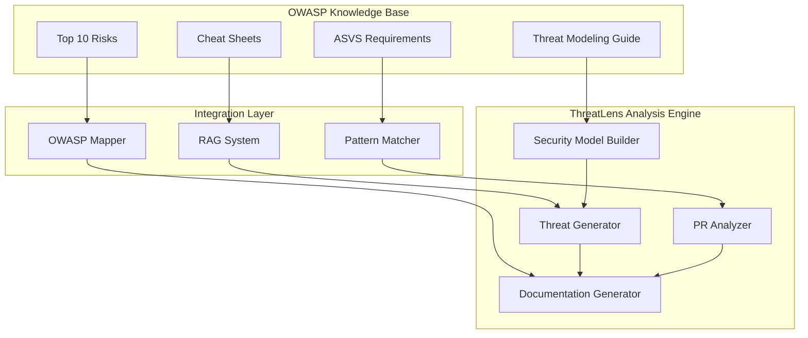

# OWASP Alignment Documentation

## Overview

ThreatLens is designed with OWASP standards and methodologies at its core. This document provides a comprehensive mapping of OWASP cheat sheets, frameworks, and methodologies to specific ThreatLens features and implementations.

## OWASP Cheat Sheets Integration

### Core Threat Modeling Cheat Sheets

#### 1. Threat Modeling Cheat Sheet
- **OWASP Reference**: [Threat Modeling Cheat Sheet](https://cheatsheetseries.owasp.org/cheatsheets/Threat_Modeling_Cheat_Sheet.html)
- **ThreatLens Implementation**:
  - **Four Questions Framework**: Core analysis pipeline structured around the four threat modeling questions
    - "What are we working on?" → Repository structure analysis (`api/repo_ingest.py`, `api/security_model.py`)
    - "What can go wrong?" → STRIDE-based threat identification (`api/threat_docs.py`)
    - "What are we going to do about it?" → Mitigation recommendations (`api/security_wiki_generator.py`)
    - "Did we do a good enough job?" → Review checklist generation (planned in backend restructure)
  - **STRIDE Framework**: Implemented in `api/models.py` with StrideCategory enum
  - **Threat Identification**: Systematic threat detection in security model builder
- **Integration Points**:
  - Security model construction follows OWASP threat modeling methodology
  - Generated documentation uses OWASP-recommended threat categorization
  - Risk assessment incorporates OWASP risk rating factors

#### 2. Secure Product Design Cheat Sheet
- **OWASP Reference**: [Secure Product Design Cheat Sheet](https://cheatsheetseries.owasp.org/cheatsheets/Secure_Product_Design_Cheat_Sheet.html)
- **ThreatLens Implementation**:
  - **Security by Design**: Architecture analysis identifies security patterns and anti-patterns
  - **Trust Boundaries**: Automatic identification and mapping in `api/security_model.py`
  - **Data Flow Analysis**: Comprehensive data flow mapping with sensitivity classification
  - **Component Security**: Security-focused component categorization and analysis
- **Integration Points**:
  - Repository analysis evaluates adherence to secure design principles
  - Generated recommendations align with OWASP secure design guidelines
  - Architecture documentation includes security design assessment

### Authentication and Session Management

#### 3. Authentication Cheat Sheet
- **OWASP Reference**: [Authentication Cheat Sheet](https://cheatsheetseries.owasp.org/cheatsheets/Authentication_Cheat_Sheet.html)
- **ThreatLens Implementation**:
  - **Authentication Mechanism Detection**: Identifies JWT, OAuth, session-based, and other auth patterns
  - **Security Pattern Analysis**: Detects authentication anti-patterns and vulnerabilities
  - **Multi-Factor Authentication**: Identifies MFA implementations and gaps
- **Integration Points**:
  - `api/security_model.py`: Authentication mechanism detection and classification
  - `api/pr_analyzer.py`: Authentication-related change analysis
  - Generated documentation includes authentication security assessment

#### 4. Session Management Cheat Sheet
- **OWASP Reference**: [Session Management Cheat Sheet](https://cheatsheetseries.owasp.org/cheatsheets/Session_Management_Cheat_Sheet.html)
- **ThreatLens Implementation**:
  - **Session Security Analysis**: Identifies session handling patterns and security measures
  - **Cookie Security**: Analyzes cookie configuration and security attributes
  - **Session Lifecycle**: Maps session creation, management, and termination flows
- **Integration Points**:
  - Security model builder identifies session management components
  - PR analysis flags session-related security changes
  - Threat documentation includes session security considerations

### Input Validation and Data Handling

#### 5. Input Validation Cheat Sheet
- **OWASP Reference**: [Input Validation Cheat Sheet](https://cheatsheetseries.owasp.org/cheatsheets/Input_Validation_Cheat_Sheet.html)
- **ThreatLens Implementation**:
  - **Input Validation Pattern Detection**: Identifies validation frameworks and custom validation logic
  - **Sanitization Analysis**: Detects input sanitization and encoding practices
  - **Injection Prevention**: Analyzes protection against injection attacks
- **Integration Points**:
  - `api/security_model.py`: Input validation pattern recognition
  - `api/pr_analyzer.py`: Input handling change analysis
  - Threat identification includes input validation gaps

#### 6. SQL Injection Prevention Cheat Sheet
- **OWASP Reference**: [SQL Injection Prevention Cheat Sheet](https://cheatsheetseries.owasp.org/cheatsheets/SQL_Injection_Prevention_Cheat_Sheet.html)
- **ThreatLens Implementation**:
  - **Database Query Analysis**: Identifies parameterized queries vs. string concatenation
  - **ORM Security**: Analyzes ORM usage and potential SQL injection vectors
  - **Stored Procedure Security**: Evaluates stored procedure implementations
- **Integration Points**:
  - Data store analysis includes SQL injection risk assessment
  - PR analysis flags database query changes
  - Generated threats include SQL injection scenarios

### Access Control and Authorization

#### 7. Access Control Cheat Sheet
- **OWASP Reference**: [Access Control Cheat Sheet](https://cheatsheetseries.owasp.org/cheatsheets/Access_Control_Cheat_Sheet.html)
- **ThreatLens Implementation**:
  - **Authorization Pattern Detection**: Identifies RBAC, ABAC, and other access control models
  - **Privilege Analysis**: Maps user roles and permissions
  - **Access Control Enforcement**: Analyzes authorization checks at API endpoints
- **Integration Points**:
  - Component analysis includes access control mechanism identification
  - Endpoint security analysis evaluates authorization requirements
  - Threat modeling includes privilege escalation scenarios

#### 8. Authorization Testing Cheat Sheet
- **OWASP Reference**: [Authorization Testing Cheat Sheet](https://cheatsheetseries.owasp.org/cheatsheets/Authorization_Testing_Cheat_Sheet.html)
- **ThreatLens Implementation**:
  - **Authorization Gap Analysis**: Identifies endpoints lacking proper authorization
  - **Test Case Generation**: Suggests authorization test scenarios (planned feature)
  - **Privilege Boundary Analysis**: Maps privilege boundaries and potential violations
- **Integration Points**:
  - Security model includes authorization testing recommendations
  - Generated documentation suggests authorization test cases
  - PR analysis evaluates authorization changes

### Cryptography and Data Protection

#### 9. Cryptographic Storage Cheat Sheet
- **OWASP Reference**: [Cryptographic Storage Cheat Sheet](https://cheatsheetseries.owasp.org/cheatsheets/Cryptographic_Storage_Cheat_Sheet.html)
- **ThreatLens Implementation**:
  - **Encryption Pattern Detection**: Identifies encryption libraries and implementations
  - **Key Management Analysis**: Analyzes cryptographic key handling practices
  - **Data-at-Rest Protection**: Evaluates database and file encryption
- **Integration Points**:
  - Sensitive data handling analysis includes encryption assessment
  - Cryptographic pattern detection in security model builder
  - Threat scenarios include cryptographic failures

#### 10. Transport Layer Security Cheat Sheet
- **OWASP Reference**: [Transport Layer Security Cheat Sheet](https://cheatsheetseries.owasp.org/cheatsheets/Transport_Layer_Security_Cheat_Sheet.html)
- **ThreatLens Implementation**:
  - **TLS Configuration Analysis**: Identifies HTTPS implementation and configuration
  - **Certificate Management**: Analyzes SSL/TLS certificate handling
  - **Secure Communication**: Maps encrypted communication channels
- **Integration Points**:
  - Network security analysis includes TLS assessment
  - External dependency analysis evaluates secure communication
  - Infrastructure security includes TLS configuration review

### Web Application Security

#### 11. Cross-Site Scripting (XSS) Prevention Cheat Sheet
- **OWASP Reference**: [XSS Prevention Cheat Sheet](https://cheatsheetseries.owasp.org/cheatsheets/Cross_Site_Scripting_Prevention_Cheat_Sheet.html)
- **ThreatLens Implementation**:
  - **Output Encoding Analysis**: Identifies output encoding and escaping practices
  - **Content Security Policy**: Analyzes CSP implementation and configuration
  - **XSS Prevention Patterns**: Detects XSS protection mechanisms
- **Integration Points**:
  - Frontend security analysis includes XSS prevention assessment
  - Template and view analysis for XSS vulnerabilities
  - Web application threat modeling includes XSS scenarios

#### 12. Cross-Site Request Forgery (CSRF) Prevention Cheat Sheet
- **OWASP Reference**: [CSRF Prevention Cheat Sheet](https://cheatsheetseries.owasp.org/cheatsheets/Cross_Site_Request_Forgery_Prevention_Cheat_Sheet.html)
- **ThreatLens Implementation**:
  - **CSRF Token Analysis**: Identifies CSRF protection mechanisms
  - **SameSite Cookie Analysis**: Evaluates SameSite cookie attributes
  - **State-Changing Operation Protection**: Analyzes protection for sensitive operations
- **Integration Points**:
  - Web endpoint analysis includes CSRF protection assessment
  - Form and API security evaluation
  - Threat scenarios include CSRF attack vectors

### API Security

#### 13. REST Security Cheat Sheet
- **OWASP Reference**: [REST Security Cheat Sheet](https://cheatsheetseries.owasp.org/cheatsheets/REST_Security_Cheat_Sheet.html)
- **ThreatLens Implementation**:
  - **API Endpoint Security**: Comprehensive REST API security analysis
  - **HTTP Method Security**: Analyzes proper HTTP method usage and restrictions
  - **API Authentication**: Evaluates API authentication and authorization mechanisms
- **Integration Points**:
  - `api/security_model.py`: REST endpoint detection and security analysis
  - API-specific threat modeling and documentation
  - REST security pattern recognition

#### 14. GraphQL Cheat Sheet
- **OWASP Reference**: [GraphQL Cheat Sheet](https://cheatsheetseries.owasp.org/cheatsheets/GraphQL_Cheat_Sheet.html)
- **ThreatLens Implementation**:
  - **GraphQL Schema Analysis**: Identifies GraphQL implementations and schema security
  - **Query Complexity Analysis**: Evaluates query depth and complexity limitations
  - **GraphQL-Specific Threats**: Includes GraphQL-specific threat scenarios
- **Integration Points**:
  - GraphQL endpoint detection and analysis
  - Schema security assessment
  - GraphQL-specific security recommendations

### Cloud and Infrastructure Security

#### 15. Docker Security Cheat Sheet
- **OWASP Reference**: [Docker Security Cheat Sheet](https://cheatsheetseries.owasp.org/cheatsheets/Docker_Security_Cheat_Sheet.html)
- **ThreatLens Implementation**:
  - **Container Security Analysis**: Analyzes Dockerfile and container configurations
  - **Image Security**: Evaluates base image choices and security practices
  - **Runtime Security**: Assesses container runtime security configurations
- **Integration Points**:
  - Infrastructure analysis includes Docker security assessment
  - Dockerfile analysis for security anti-patterns
  - Container-specific threat modeling

#### 16. Kubernetes Security Cheat Sheet
- **OWASP Reference**: [Kubernetes Security Cheat Sheet](https://cheatsheetseries.owasp.org/cheatsheets/Kubernetes_Security_Cheat_Sheet.html)
- **ThreatLens Implementation**:
  - **K8s Configuration Analysis**: Analyzes Kubernetes manifests and configurations
  - **Pod Security**: Evaluates pod security policies and contexts
  - **Network Security**: Assesses Kubernetes network policies and segmentation
- **Integration Points**:
  - Kubernetes manifest analysis for security configurations
  - Container orchestration security assessment
  - Cloud-native threat modeling

### Logging and Monitoring

#### 17. Logging Cheat Sheet
- **OWASP Reference**: [Logging Cheat Sheet](https://cheatsheetseries.owasp.org/cheatsheets/Logging_Cheat_Sheet.html)
- **ThreatLens Implementation**:
  - **Logging Pattern Analysis**: Identifies logging frameworks and security event logging
  - **Audit Trail Analysis**: Evaluates audit logging for security events
  - **Log Security**: Analyzes log protection and sensitive data handling in logs
- **Integration Points**:
  - Security monitoring analysis includes logging assessment
  - Audit trail evaluation for security events
  - Logging security recommendations

### Secure Development Practices

#### 18. Secure Code Review Cheat Sheet
- **OWASP Reference**: [Secure Code Review Cheat Sheet](https://cheatsheetseries.owasp.org/cheatsheets/Code_Review_Cheat_Sheet.html)
- **ThreatLens Implementation**:
  - **Automated Code Review**: PR analysis includes security-focused code review
  - **Security Pattern Detection**: Identifies security anti-patterns during code review
  - **Review Checklist Generation**: Generates security-focused review checklists
- **Integration Points**:
  - `api/pr_analyzer.py`: Security-focused PR analysis
  - Automated security code review recommendations
  - Security review checklist generation

## OWASP Top 10 Integration

### OWASP Top 10 Web Application Security Risks
ThreatLens threat identification and analysis specifically addresses each OWASP Top 10 category:

1. **A01:2021 – Broken Access Control**
   - Access control pattern detection and analysis
   - Authorization gap identification
   - Privilege escalation threat scenarios

2. **A02:2021 – Cryptographic Failures**
   - Encryption implementation analysis
   - Key management assessment
   - Cryptographic vulnerability identification

3. **A03:2021 – Injection**
   - SQL injection prevention analysis
   - Input validation assessment
   - Injection attack vector identification

4. **A04:2021 – Insecure Design**
   - Secure design principle evaluation
   - Architecture security assessment
   - Design flaw identification

5. **A05:2021 – Security Misconfiguration**
   - Configuration security analysis
   - Default configuration assessment
   - Misconfiguration threat scenarios

6. **A06:2021 – Vulnerable and Outdated Components**
   - Dependency analysis and vulnerability assessment
   - Third-party component security evaluation
   - Supply chain security analysis

7. **A07:2021 – Identification and Authentication Failures**
   - Authentication mechanism analysis
   - Session management assessment
   - Identity security evaluation

8. **A08:2021 – Software and Data Integrity Failures**
   - Data integrity protection analysis
   - Software supply chain security
   - Integrity verification assessment

9. **A09:2021 – Security Logging and Monitoring Failures**
   - Logging security analysis
   - Monitoring capability assessment
   - Incident detection evaluation

10. **A10:2021 – Server-Side Request Forgery (SSRF)**
    - SSRF vulnerability detection
    - External request validation analysis
    - Network security boundary assessment

## OWASP ASVS Integration

### Application Security Verification Standard (ASVS)
ThreatLens incorporates OWASP ASVS requirements in its analysis and recommendations:

- **V1: Architecture, Design and Threat Modeling Requirements**
  - Architectural security analysis
  - Threat modeling methodology compliance
  - Security design verification

- **V2: Authentication Verification Requirements**
  - Authentication mechanism verification
  - Multi-factor authentication assessment
  - Authentication security analysis

- **V3: Session Management Verification Requirements**
  - Session security analysis
  - Session lifecycle verification
  - Session protection assessment

- **V4: Access Control Verification Requirements**
  - Authorization mechanism verification
  - Access control implementation analysis
  - Privilege management assessment

- **V5: Validation, Sanitization and Encoding Verification Requirements**
  - Input validation verification
  - Output encoding analysis
  - Data sanitization assessment

## Implementation Mapping

### Current Implementation Status

#### Fully Implemented
- ✅ **Threat Modeling Methodology**: Core four-question framework
- ✅ **STRIDE Framework**: Complete threat categorization
- ✅ **Authentication Analysis**: Comprehensive auth mechanism detection
- ✅ **Input Validation**: Pattern detection and analysis
- ✅ **API Security**: REST endpoint security analysis
- ✅ **Container Security**: Docker configuration analysis

#### Partially Implemented
- 🔄 **Access Control**: Basic pattern detection, needs enhancement
- 🔄 **Cryptographic Analysis**: Basic encryption detection, needs key management analysis
- 🔄 **Logging Security**: Basic logging pattern detection, needs audit trail analysis
- 🔄 **Configuration Security**: Basic config analysis, needs comprehensive assessment

#### Planned for Backend Restructure
- 📋 **OWASP Cheat Sheet Integration**: Systematic cheat sheet content integration
- 📋 **ASVS Compliance**: Comprehensive ASVS requirement verification
- 📋 **Review Checklist Generation**: OWASP-based security review checklists
- 📋 **Mitigation Mapping**: Direct OWASP mitigation strategy mapping

### Integration Architecture

## Future Enhancements

### Planned OWASP Integrations

1. **Enhanced Cheat Sheet Integration**
   - Direct cheat sheet content embedding in analysis
   - Context-aware cheat sheet recommendations
   - Automated cheat sheet content updates

2. **ASVS Compliance Verification**
   - Systematic ASVS requirement verification
   - Compliance gap identification
   - ASVS-based security scoring

3. **OWASP Testing Guide Integration**
   - Automated security test case generation
   - Testing methodology compliance
   - Security testing recommendations

4. **SAMM Integration**
   - Software Assurance Maturity Model assessment
   - Organizational security maturity evaluation
   - SAMM-based improvement recommendations

This comprehensive OWASP alignment ensures that ThreatLens provides security analysis and recommendations that are grounded in industry-standard security practices and methodologies.