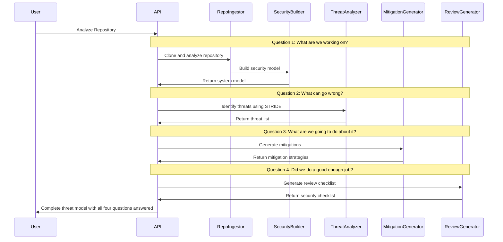

# Threat Modeling Flow Documentation

## Overview

ThreatLens implements the OWASP Threat Modeling methodology based on the four fundamental questions that drive effective threat modeling. This document explains how ThreatLens systematically addresses each question through its analysis pipeline and provides examples of generated outputs.

## The Four Questions Framework

The OWASP Threat Modeling Cheat Sheet defines four key questions that every threat modeling exercise should answer:

1. **What are we working on?**
2. **What can go wrong?**
3. **What are we going to do about it?**
4. **Did we do a good enough job?**

ThreatLens structures its entire analysis pipeline around these questions, ensuring comprehensive and methodical security analysis.

## Question 1: "What are we working on?"

### Purpose
This question focuses on understanding the system architecture, components, data flows, and trust boundaries. It establishes the foundation for all subsequent threat analysis.

### ThreatLens Implementation

#### System Discovery and Modeling
**Location**: `api/repo_ingest.py`, `api/security_model.py`

```python
# Repository structure analysis
def analyze_repository_structure(repo_path: str) -> StructureAnalysis:
    """
    Comprehensive repository analysis to understand what we're working on
    """
    analysis = StructureAnalysis()
    
    # Language and framework detection
    analysis.primary_languages = detect_languages(repo_path)
    analysis.detected_frameworks = detect_frameworks(repo_path)
    
    # Directory structure mapping
    analysis.directory_structure = map_directory_structure(repo_path)
    analysis.key_directories = identify_key_directories(repo_path)
    
    return analysis
```

#### Component Identification
**Location**: `api/security_model.py`

```python
def _detect_security_components(self, repo_context: RepoContext) -> List[Component]:
    """
    Identify and classify all system components
    """
    components = []
    
    # Detect different component types
    controllers = self._find_controllers(repo_context)
    services = self._find_services(repo_context)
    models = self._find_models(repo_context)
    middleware = self._find_middleware(repo_context)
    
    # Analyze each component for security relevance
    for component in all_components:
        security_analysis = self._analyze_component_security(component)
        components.append(security_analysis)
    
    return components
```

#### Data Flow Analysis
**Location**: `api/security_model.py`

```python
def _build_data_flow_analysis(self, components: List[Component], 
                             data_stores: List[DataStore]) -> List[Flow]:
    """
    Map data flows between components and data stores
    """
    flows = []
    
    for component in components:
        # Analyze API endpoints for data flow
        for endpoint in component.endpoints:
            flow = self._analyze_endpoint_data_flow(endpoint, components, data_stores)
            if flow:
                flows.append(flow)
    
    return flows
```

#### Trust Boundary Identification
**Location**: `api/security_model.py`

```python
def _identify_trust_boundaries(self, components: List[Component], 
                              data_stores: List[DataStore]) -> List[TrustBoundary]:
    """
    Identify trust boundaries in the system architecture
    """
    boundaries = []
    
    # Network boundaries (external vs internal)
    external_boundary = self._identify_external_boundary(components)
    boundaries.append(external_boundary)
    
    # Process boundaries (different services/applications)
    process_boundaries = self._identify_process_boundaries(components)
    boundaries.extend(process_boundaries)
    
    # Privilege boundaries (different user roles/permissions)
    privilege_boundaries = self._identify_privilege_boundaries(components)
    boundaries.extend(privilege_boundaries)
    
    return boundaries
```

### Example Output: System Model

```json
{
  "system_model": {
    "id": "ecommerce-api",
    "name": "E-commerce API System",
    "components": [
      {
        "id": "user_controller",
        "name": "UserController",
        "type": "controller",
        "endpoints": [
          {
            "path": "/api/users/login",
            "method": "POST",
            "requires_auth": false,
            "sensitive_data": true
          },
          {
            "path": "/api/users/profile",
            "method": "GET",
            "requires_auth": true,
            "sensitive_data": true
          }
        ],
        "auth_mechanisms": ["JWT", "Session"],
        "handles_sensitive_data": true
      }
    ],
    "data_stores": [
      {
        "id": "user_database",
        "name": "PostgreSQL User Database",
        "type": "database",
        "sensitive_data_types": ["user_data", "authentication_data"]
      }
    ],
    "trust_boundaries": [
      {
        "id": "external_boundary",
        "name": "Internet to Application",
        "description": "Boundary between external users and the application"
      }
    ]
  }
}
```

## Question 2: "What can go wrong?"

### Purpose
This question focuses on identifying potential threats using systematic approaches like STRIDE. It builds upon the system understanding from Question 1.

### ThreatLens Implementation

#### STRIDE-Based Threat Identification
**Location**: `api/threat_docs.py`, threat identification logic

```python
class StrideAnalyzer:
    """
    Systematic STRIDE-based threat identification
    """
    
    def identify_spoofing_threats(self, system: SecurityModel) -> List[Threat]:
        """
        Identify spoofing threats - impersonation of users or systems
        """
        threats = []
        
        for component in system.components:
            # Check for weak authentication
            if not component.auth_mechanisms:
                threat = Threat(
                    id=f"spoofing_{component.id}_no_auth",
                    stride_category=StrideCategory.SPOOFING,
                    description=f"Component {component.name} lacks authentication, "
                               f"allowing potential user impersonation",
                    affected_components=[component.id],
                    likelihood=LikelihoodLevel.HIGH,
                    impact_level=ImpactLevel.HIGH
                )
                threats.append(threat)
        
        return threats
    
    def identify_tampering_threats(self, system: SecurityModel) -> List[Threat]:
        """
        Identify tampering threats - unauthorized modification of data
        """
        threats = []
        
        for flow in system.flows:
            # Check for unprotected data transmission
            if not self._has_integrity_protection(flow):
                threat = Threat(
                    id=f"tampering_{flow.id}_no_integrity",
                    stride_category=StrideCategory.TAMPERING,
                    description=f"Data flow {flow.name} lacks integrity protection, "
                               f"allowing potential data modification",
                    affected_components=flow.components_involved,
                    likelihood=LikelihoodLevel.MEDIUM,
                    impact_level=ImpactLevel.HIGH
                )
                threats.append(threat)
        
        return threats
```

#### Context-Aware Threat Analysis
**Location**: `api/threat_docs.py`

```python
def generate_contextual_threats(self, system: SecurityModel, 
                               repo_context: RepoContext) -> List[Threat]:
    """
    Generate threats based on specific technology stack and patterns
    """
    threats = []
    
    # Framework-specific threats
    for framework in repo_context.detected_frameworks:
        framework_threats = self._get_framework_threats(framework, system)
        threats.extend(framework_threats)
    
    # Language-specific threats
    for language in repo_context.primary_languages:
        language_threats = self._get_language_threats(language, system)
        threats.extend(language_threats)
    
    return threats
```

### STRIDE Table Implementation

ThreatLens uses a comprehensive STRIDE table to systematically identify threats:

| STRIDE Category | Threat Examples | ThreatLens Detection |
|----------------|-----------------|---------------------|
| **Spoofing** | User impersonation, System impersonation | Authentication mechanism analysis, Identity verification gaps |
| **Tampering** | Data modification, Code injection | Input validation analysis, Integrity protection assessment |
| **Repudiation** | Denial of actions, Log manipulation | Audit logging analysis, Non-repudiation mechanism detection |
| **Information Disclosure** | Data leakage, Unauthorized access | Access control analysis, Data exposure assessment |
| **Denial of Service** | Resource exhaustion, Service disruption | Rate limiting analysis, Resource protection assessment |
| **Elevation of Privilege** | Privilege escalation, Authorization bypass | Authorization mechanism analysis, Privilege boundary assessment |

### Example Output: Threat Analysis

```json
{
  "threats": [
    {
      "id": "T001",
      "stride_category": "spoofing",
      "title": "Authentication Bypass in Login Endpoint",
      "description": "The /api/users/login endpoint lacks proper input validation, potentially allowing authentication bypass through SQL injection or other injection attacks.",
      "affected_components": ["user_controller", "user_database"],
      "likelihood": "high",
      "impact": "critical",
      "attack_vectors": [
        "SQL injection in login parameters",
        "NoSQL injection in authentication queries",
        "LDAP injection in directory authentication"
      ],
      "prerequisites": [
        "Access to login endpoint",
        "Knowledge of injection techniques"
      ],
      "cwe_references": ["CWE-89", "CWE-287"]
    },
    {
      "id": "T002",
      "stride_category": "information_disclosure",
      "title": "Sensitive Data Exposure in API Responses",
      "description": "User profile endpoint returns sensitive information without proper filtering, potentially exposing PII to unauthorized users.",
      "affected_components": ["user_controller"],
      "likelihood": "medium",
      "impact": "high",
      "attack_vectors": [
        "Direct API access with valid token",
        "Token theft and misuse"
      ]
    }
  ]
}
```

## Question 3: "What are we going to do about it?"

### Purpose
This question focuses on identifying and implementing appropriate mitigations, controls, and responses to the identified threats.

### ThreatLens Implementation

#### Mitigation Strategy Generation
**Location**: `api/security_wiki_generator.py`

```python
def generate_mitigation_strategies(self, threats: List[Threat], 
                                 system: SecurityModel) -> List[Mitigation]:
    """
    Generate specific mitigation strategies for identified threats
    """
    mitigations = []
    
    for threat in threats:
        # OWASP-based mitigation mapping
        owasp_mitigations = self._get_owasp_mitigations(threat)
        
        # Technology-specific mitigations
        tech_mitigations = self._get_technology_mitigations(threat, system)
        
        # Implementation-specific mitigations
        impl_mitigations = self._get_implementation_mitigations(threat, system)
        
        mitigations.extend(owasp_mitigations + tech_mitigations + impl_mitigations)
    
    return mitigations
```

#### OWASP Cheat Sheet Integration
**Location**: `api/rag.py` (RAG system for OWASP content retrieval)

```python
def get_relevant_owasp_guidance(self, threat: Threat) -> Dict[str, Any]:
    """
    Retrieve relevant OWASP cheat sheet content for threat mitigation
    """
    # Map STRIDE category to relevant cheat sheets
    cheat_sheet_mapping = {
        StrideCategory.SPOOFING: ["authentication", "session-management"],
        StrideCategory.TAMPERING: ["input-validation", "cryptographic-storage"],
        StrideCategory.INFORMATION_DISCLOSURE: ["access-control", "transport-layer-security"],
        # ... other mappings
    }
    
    relevant_sheets = cheat_sheet_mapping.get(threat.stride_category, [])
    guidance = {}
    
    for sheet in relevant_sheets:
        content = self._retrieve_cheat_sheet_content(sheet, threat.description)
        guidance[sheet] = content
    
    return guidance
```

#### Risk-Based Prioritization
**Location**: `api/threat_docs.py`

```python
def prioritize_mitigations(self, mitigations: List[Mitigation], 
                          threats: List[Threat]) -> List[Mitigation]:
    """
    Prioritize mitigations based on risk assessment
    """
    # Calculate risk scores (likelihood × impact)
    for mitigation in mitigations:
        related_threats = [t for t in threats if mitigation.id in t.mitigations]
        risk_score = sum(self._calculate_risk_score(t) for t in related_threats)
        mitigation.priority_score = risk_score
    
    # Sort by priority (highest risk first)
    return sorted(mitigations, key=lambda m: m.priority_score, reverse=True)
```

### Example Output: Mitigation Strategies

```json
{
  "mitigations": [
    {
      "id": "M001",
      "threat_id": "T001",
      "title": "Implement Parameterized Queries",
      "description": "Replace string concatenation with parameterized queries to prevent SQL injection attacks.",
      "category": "input_validation",
      "priority": "critical",
      "implementation_guidance": {
        "code_example": "// Use parameterized queries\nconst query = 'SELECT * FROM users WHERE email = ? AND password = ?';\ndb.query(query, [email, hashedPassword]);",
        "frameworks": {
          "node.js": "Use prepared statements with mysql2 or pg libraries",
          "python": "Use SQLAlchemy ORM or parameterized queries with psycopg2",
          "java": "Use PreparedStatement instead of Statement"
        }
      },
      "owasp_references": [
        "SQL Injection Prevention Cheat Sheet",
        "Input Validation Cheat Sheet"
      ],
      "verification_criteria": [
        "All database queries use parameterized statements",
        "No string concatenation in SQL queries",
        "Input validation implemented for all user inputs"
      ]
    },
    {
      "id": "M002",
      "threat_id": "T002",
      "title": "Implement Response Filtering",
      "description": "Filter sensitive data from API responses based on user permissions and data classification.",
      "category": "access_control",
      "priority": "high",
      "implementation_guidance": {
        "pattern": "Data Transfer Object (DTO) pattern with field filtering",
        "code_example": "// Filter sensitive fields based on user role\nconst filteredUser = filterUserData(user, currentUser.role);"
      },
      "owasp_references": [
        "Access Control Cheat Sheet",
        "REST Security Cheat Sheet"
      ]
    }
  ]
}
```

## Question 4: "Did we do a good enough job?"

### Purpose
This question focuses on validation, review, and continuous improvement of the threat modeling process and security implementations.

### ThreatLens Implementation

#### Security Review Checklist Generation
**Location**: `api/security_wiki_generator.py` (planned enhancement)

```python
def generate_security_checklist(self, system: SecurityModel, 
                               threats: List[Threat], 
                               mitigations: List[Mitigation]) -> SecurityChecklist:
    """
    Generate comprehensive security review checklist
    """
    checklist = SecurityChecklist()
    
    # OWASP-based review items
    owasp_items = self._generate_owasp_checklist_items(system)
    checklist.owasp_compliance.extend(owasp_items)
    
    # Threat-specific review items
    threat_items = self._generate_threat_review_items(threats)
    checklist.threat_coverage.extend(threat_items)
    
    # Mitigation verification items
    mitigation_items = self._generate_mitigation_review_items(mitigations)
    checklist.mitigation_verification.extend(mitigation_items)
    
    return checklist
```

#### Coverage Analysis
**Location**: `api/threat_docs.py`

```python
def analyze_threat_coverage(self, system: SecurityModel, 
                           threats: List[Threat]) -> CoverageAnalysis:
    """
    Analyze completeness of threat identification and mitigation
    """
    analysis = CoverageAnalysis()
    
    # STRIDE coverage analysis
    stride_coverage = self._analyze_stride_coverage(threats)
    analysis.stride_coverage = stride_coverage
    
    # Component coverage analysis
    component_coverage = self._analyze_component_coverage(system, threats)
    analysis.component_coverage = component_coverage
    
    # Trust boundary coverage analysis
    boundary_coverage = self._analyze_boundary_coverage(system, threats)
    analysis.boundary_coverage = boundary_coverage
    
    return analysis
```

#### Continuous Monitoring Integration
**Location**: `api/monitoring.py`

```python
def setup_security_monitoring(self, system: SecurityModel, 
                             threats: List[Threat]) -> MonitoringConfig:
    """
    Configure monitoring based on identified threats
    """
    config = MonitoringConfig()
    
    for threat in threats:
        # Generate monitoring rules for each threat
        monitoring_rules = self._generate_monitoring_rules(threat)
        config.rules.extend(monitoring_rules)
        
        # Set up alerting for critical threats
        if threat.impact_level == ImpactLevel.CRITICAL:
            alert_config = self._generate_alert_config(threat)
            config.alerts.append(alert_config)
    
    return config
```

### Example Output: Security Review Checklist

```json
{
  "security_checklist": {
    "owasp_compliance": [
      {
        "category": "Authentication",
        "items": [
          {
            "id": "AUTH-001",
            "description": "Multi-factor authentication implemented for admin accounts",
            "status": "pending",
            "evidence_required": "Configuration screenshots or code review"
          },
          {
            "id": "AUTH-002",
            "description": "Password complexity requirements enforced",
            "status": "pending",
            "evidence_required": "Password policy configuration"
          }
        ]
      }
    ],
    "threat_coverage": [
      {
        "threat_id": "T001",
        "verification_items": [
          {
            "description": "Parameterized queries implemented for all database operations",
            "test_method": "Code review and static analysis",
            "status": "pending"
          },
          {
            "description": "Input validation implemented for login parameters",
            "test_method": "Penetration testing",
            "status": "pending"
          }
        ]
      }
    ],
    "coverage_metrics": {
      "stride_coverage": {
        "spoofing": 85,
        "tampering": 90,
        "repudiation": 70,
        "information_disclosure": 95,
        "denial_of_service": 60,
        "elevation_of_privilege": 80
      },
      "overall_coverage": 80
    }
  }
}
```

## Integration Flow

### Complete Threat Modeling Pipeline



### Output Integration

The four questions are integrated into a comprehensive threat modeling document:

```markdown
# Threat Model: E-commerce API System

## 1. What are we working on?
### System Architecture
- **Components**: 12 identified (controllers, services, models)
- **Data Stores**: 3 databases, 1 cache layer
- **Trust Boundaries**: 4 identified boundaries
- **Data Flows**: 23 mapped flows with sensitivity classification

## 2. What can go wrong?
### Identified Threats (STRIDE Analysis)
- **Spoofing**: 3 threats identified
- **Tampering**: 5 threats identified
- **Repudiation**: 2 threats identified
- **Information Disclosure**: 4 threats identified
- **Denial of Service**: 3 threats identified
- **Elevation of Privilege**: 2 threats identified

## 3. What are we going to do about it?
### Mitigation Strategies
- **Critical Priority**: 5 mitigations
- **High Priority**: 8 mitigations
- **Medium Priority**: 6 mitigations
- **OWASP Compliance**: Mapped to 12 cheat sheets

## 4. Did we do a good enough job?
### Security Review Checklist
- **OWASP Compliance**: 85% coverage
- **Threat Coverage**: 19/19 threats addressed
- **Verification Items**: 47 items for validation
- **Monitoring**: 12 security monitoring rules configured
```

This comprehensive implementation ensures that ThreatLens systematically addresses all four threat modeling questions, providing thorough security analysis grounded in OWASP methodologies.